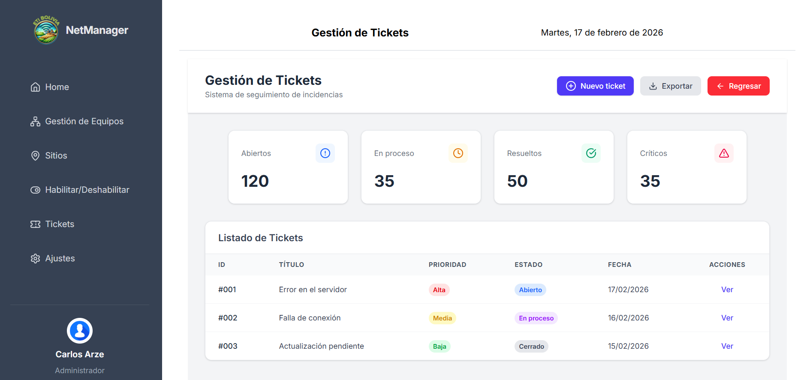

# Sistema de Monitoreo para Equipos de Redes

Plantilla base para desarrollar un sistema de monitoreo de equipos de red, con enfoque en la modularidad y mantenibilidad del código.

---

## 💻 Tecnologías utilizadas

- **HTML5 / CSS3** – Estructura y estilos básicos de la aplicación.
- **Tailwind CSS** – Para estilos modernos, responsivos y fácilmente personalizables.
- **JavaScript** – Para la lógica de la aplicación y manejo de interactividad.
- **Lucide Icons** – Iconografía ligera y escalable.
- **Leaflet.js** – Mapas interactivos para geolocalización y visualización de redes.

---

## 🎯 Propósito

Esta plantilla está diseñada como base para proyectos de monitoreo y gestión de redes, utilizando **HTML, CSS y JavaScript**.



Se centra en:

- **Mantenibilidad del código** mediante una estructura modular (usando Vite o similar), evitando archivos monolíticos.
- **Single Page Application (SPA)** para una experiencia fluida de usuario.
- Servir como punto de partida escalable para agregar funcionalidades avanzadas, como mapas interactivos, dashboards y reportes.

---

## 🚀 Instalación y uso

1. Clonar el repositorio:
   ```bash
   git clone https://github.com/ArzeCarlos/PlantillaFrontend.git
   cd PlantillaFrontend
   ```
2. Instalar las dependencias con npm:
   ```
   npm install
   ```
3. Iniciar el servidor de desarrollo de vite:
   ```
   npm run dev
   ```
